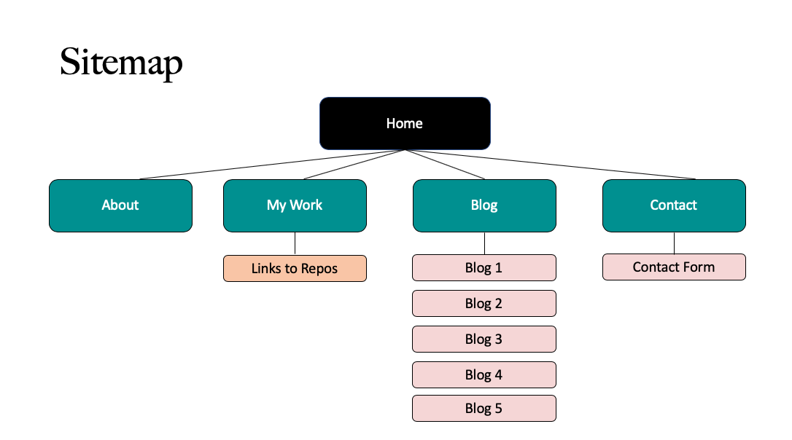

# T1A3_portfolio

Deployed site: https://shelbye.netlify.app

Remote Repository: https://github.com/Shelby219/T1A3_portfolio

------

## Purpose

The purpose of this website is to present an online resume of my work, skills, education and contact information. It can also give insight into my personality and interests. Additionally it can 

------

## Functionality / features

This website features several pages all with a cohesive responsive design with mobile, tablet and desktop capabilites. All pages are accessible by the top navigation menu, which is either spread across the home page, or via a burger toggle on a mobile or tablet. The footer is uniform across each page as well. All pages are responsive via the use of a small amount of grid, but mostly via flexbox and relevant media queries.

### Side- Wide Features

- Responsive Navigation Bar that condenses to a burger navigation toggle for mobile and tablet view

- Responsive footer with additional links

- Responsive core layout so that each page has uniformity throughout

- Return to top of the page arrow operating with jquery (goal is to re do using pure JavaScript)

- Hover underline for navigation bar and additional links

- Alternative hover for other links

- Fade in animation for page loading

- Responsive images where placed, they changed width with the screen size.

- Specifically chosen fonts that relate to my design, but with relevant fall back fonts.

- Use of SASS partials for building my styles to separate components simply so future editing is smoother.

- Sass variables for colours and fonts for easy accessibility.

### Page Specific Features

- Home page

    - Bubble animation 
    - Slide up animation for main text
    - A recent blog posts section with links to recent posts and a view all post link
    - Hover effect for the above links

- About page

    - Skills using Devicon icons

- My Work page

    - Completed projects with links to the source repository in the titles. A hover effect is on these titles.

- Blog page and seperate blog posts

    - All blog posts listed with links to the pages
    - A search posts section in place (not configured, but ready for later on)
    - Hover effect on the links to each blog post
    - A previous and next link for each blog post page

- Contact page

    - Responsive contact form layout 
    - Send button with hover effect and active effect on pressing
    - Contact form via Basin and mailthis.to so it is an active form

------
## Sitemap

------

## Images (screenshots)

------

## Target Audience

The target audience is for potential future employers looking to engage a developer, also possibly in future, potential independant contract work.

------

## Tech Stack

The following were utilised in this project:
- Balsamiq (Wireframing)
- Procreate (for my personal logo)
- HTML5
- CSS3
- SASS
- JavaScript (this was used for the burger nav toggle)
- jquery - (the return to top arrow- my goal is the redo this using my own JavaScript)
- Git & Github
- Font Awesome (for icons)
- Devicon (for technology icons)
- Google Fonts
- UseBasin (for the contact form)
- MailThis.to (for the contact form)
- Netlify (for web deployment)
- Unsplash (for blog post images)

------# new_portfolio
